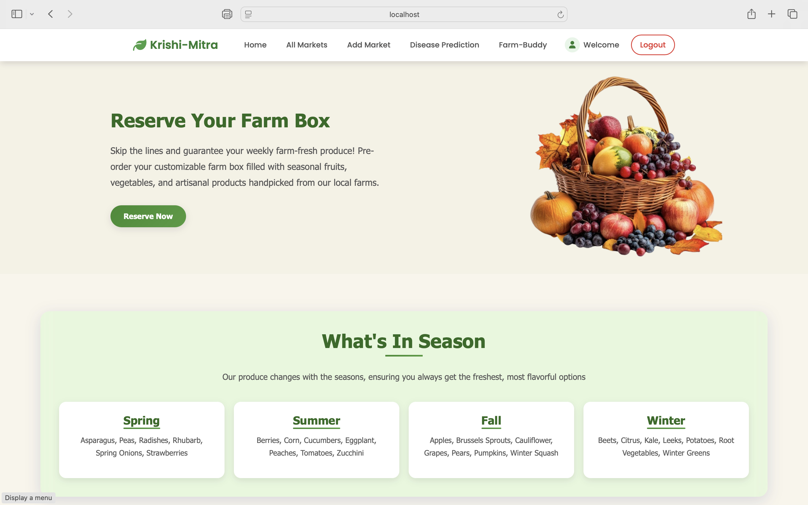
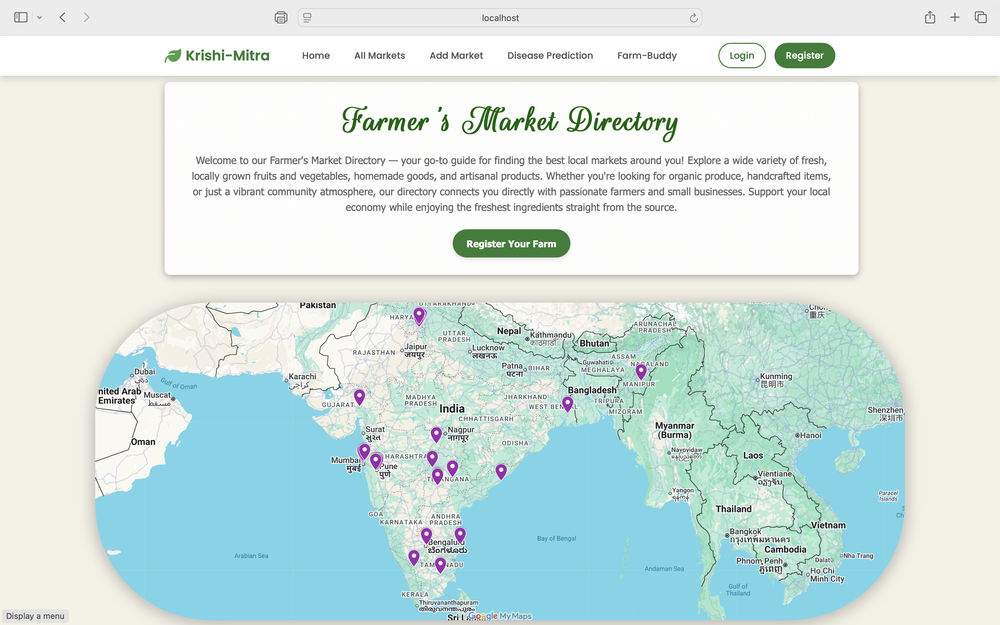
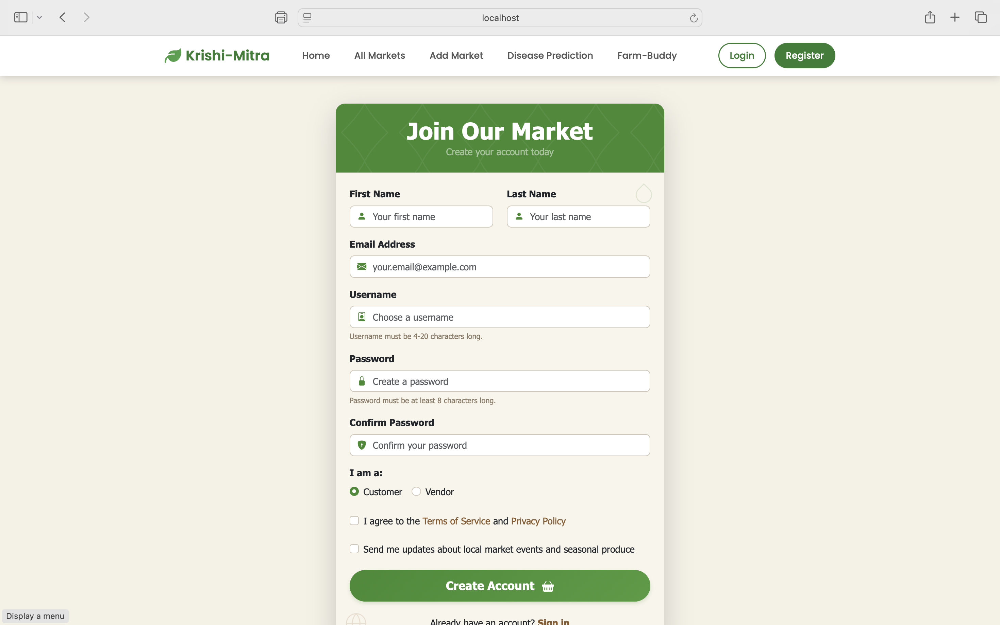
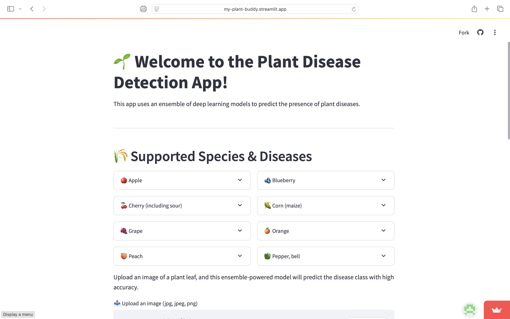
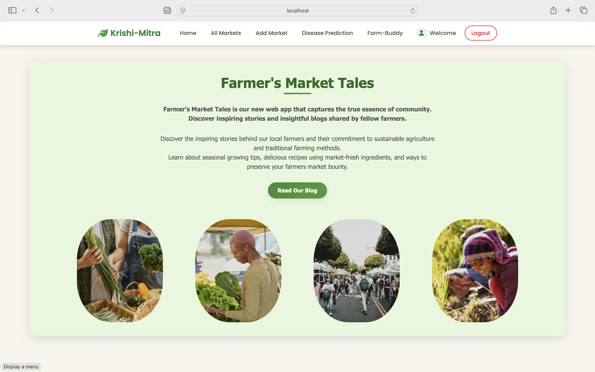
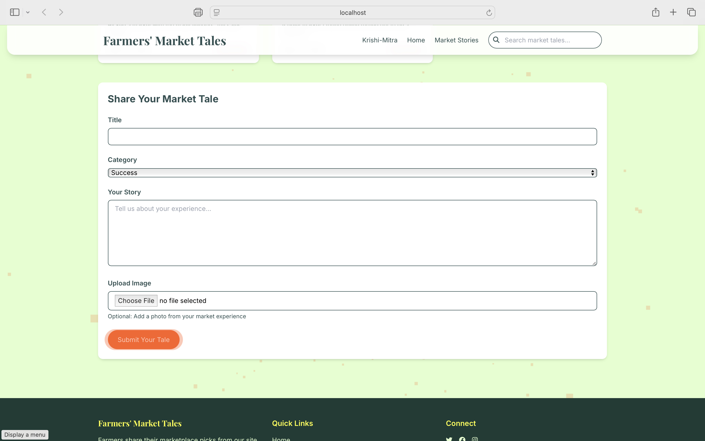
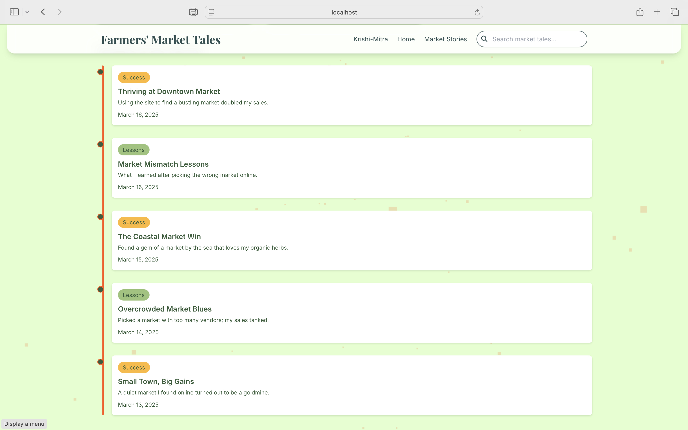

# 🌾 Hey there, fellow human! Welcome to Krishi Mitra!

_Translation: "Farmers' Friend" - because who doesn't need a good friend, especially one that knows tech?_

So you stumbled upon **Krishi Mitra**, and wondering what it is huh? Well it is a modern, full-stack web application designed to bridge the gap between traditional farming and digital innovation. This isn't just another agricultural app; it's a comprehensive platform built to genuinely help farmers thrive in today's world.

## What Makes This Different?

You know that moment when you see a problem and think "there has to be a better way to solve this"? That's exactly what happened here. **Krishi Mitra** combines latest Web and AI technology with practical farming needs to create something that actually works for real farmers.

Our platform offers:

-   🛒 **Direct marketplace** - Connect farmers directly with customers
-   🔬 **AI-powered plant disease detection** - 98.5% accuracy with real-time diagnosis
-   💬 **Intelligent farming assistant** - 24/7 expert guidance
-   📝 **Community platform** - Share knowledge and experiences
-   🗺️ **Market directory** - Find and explore local markets

## 🚀 Feature Walkthrough

### Landing Page - First Impressions Matter

The landing page focuses on user experience with clean design and intuitive navigation. Every element is crafted to make agriculture technology accessible to everyone.
(Look, I spent _way_ too much time on this landing page. It's practical, functional and kinda **_AESTHETIC_**)

As you explore further, you'll discover the full range of features:

### Market Directory - Finding Markets Made Simple

The market directory combines an interactive map with comprehensive market listings. No more guessing about market locations or what they offer.

_Interactive map showing all registered markets_

_All the markets, organized and ready to explore_

### Market Details - Everything You Need to Know

When you select a market, you get comprehensive information including precise location, product availability, seasonal information, operating hours, and facilities.

_Detailed market information with integrated mapping_

_Community-driven reviews and ratings system_

### Market Registration - Easy Setup for Vendors

Market registration is streamlined but thorough, ensuring quality information while keeping the process user-friendly.

_Comprehensive yet intuitive market registration form_

### User Authentication - Secure and Simple

Clean, secure authentication system that prioritizes user experience without compromising security.

_Streamlined authentication with robust security_

## 🧠 AI-Powered Plant Disease Detection

This is where technology meets agriculture in a meaningful way. Our plant disease detection system uses an ensemble of three CNN models to achieve remarkable accuracy.

**Technical Specifications:**

-   **98.5% accuracy rate** across all detections
-   **8 plant species** supported
-   **20+ diseases** accurately identified
-   **Ensemble learning** using DenseNet, EfficientNet, and MobileNet

_Upload leaf images for instant disease diagnosis_

_Detailed results with probability analysis_

**Smart Learning:** The system includes a repredict function for edge cases and continuously improves its accuracy through user feedback.

## 🤖 Farm Assistant Chatbot

Our intelligent chatbot provides expert farming guidance through a sophisticated two-tier system:

**Primary Layer:** Custom-trained on agricultural datasets for specialized farming knowledge
**Fallback Layer:** OpenAI API integration for comprehensive question handling

Topics covered include disease remedies, fertilizer recommendations, seasonal planning, and general agricultural best practices.

## 📝 Community Blogging Platform

_Share experiences and learn from the farming community_

_Full-featured blogging platform for knowledge sharing_

The blogging platform creates a space for farmers to share experiences, success stories, challenges, and solutions, fostering a collaborative agricultural community.

## 🛠️ Technical Architecture

**Framework:** Built using the Model-View-Controller (MVC) architecture for scalability and maintainability

**Security Features:**

-   Secure authentication and authorization using Passport.js
-   Password hashing and secure session management
-   Protected routes and data validation

**Database:** MongoDB for flexible, scalable data storage

**Backend:** Node.js with Express.js for robust API development

**AI/ML Implementation:**

-   Ensemble of pre-trained CNN models (DenseNet, EfficientNet, MobileNet)
-   Streamlit deployment for the disease detection service
-   Custom training on agricultural datasets

**API Integration:** OpenAI API for enhanced chatbot capabilities

## 🌱 The Vision Behind Krishi Mitra

Agriculture is evolving rapidly, and farmers need tools that evolve with them. **Krishi Mitra** addresses this by:

-   **Digitizing essential services** to make them more accessible
-   **Fostering community collaboration** through knowledge sharing
-   **Bringing AI insights** directly to farming practices
-   **Creating a unified platform** for multiple agricultural needs

This isn't just about adding technology to farming - it's about making technology work for farmers in practical, meaningful ways.

## 🤝 Contributing

We welcome contributions from developers, agricultural experts, and anyone passionate about improving farming through technology. Feel free to give an suggestions. I am all ears.

---

*Built with ❤️, lots of ☕, and a genuine desire to help farmers thrive in the digital age.*
