# 🌾 Krishi Mitra (Farmers' Friend): Empowering Agriculture with Technology

welcome to **Krishi Mitra**, a full-stack, modern web application , designed to assist farmers in enhancing their agricultural practices through digital tools, assistem them in various aspects such as selling their produce directly to customers, ml powered predicting disease of their plant, getting remedies and other suggestions ai powered, blogging for communinty and sharing experience, etc.

# 🚀 Website Walkthrough

## Landing Page

the landing page is beautifully designed with UI and UX having a very imortant role coz afterall this is what defines the experience of user using the website.
Here we have the first impression of the landing page.

As we scroll, we get visually appealing and functional parts of the landing page.
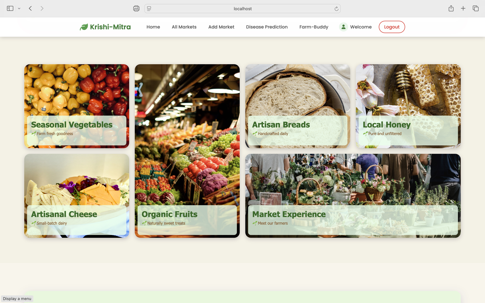
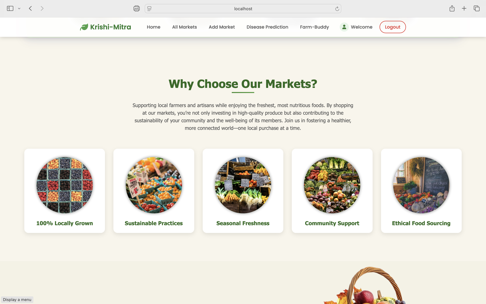
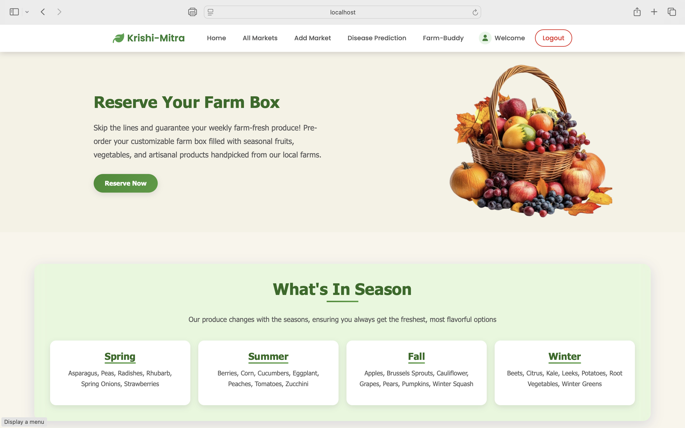
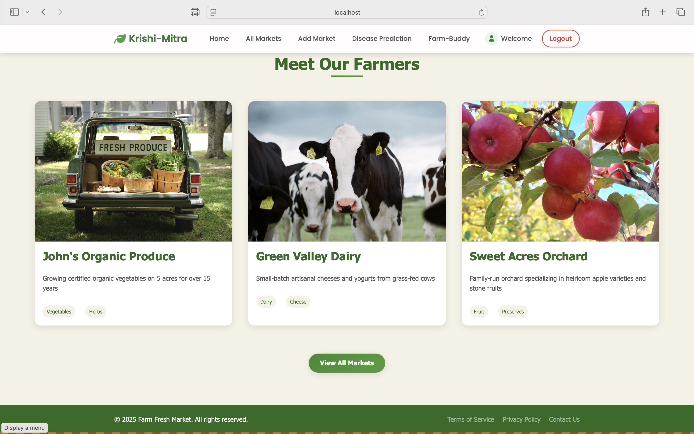

## Market Directory

We have the intro and a fully interactive map at the top of the market dirctory page.
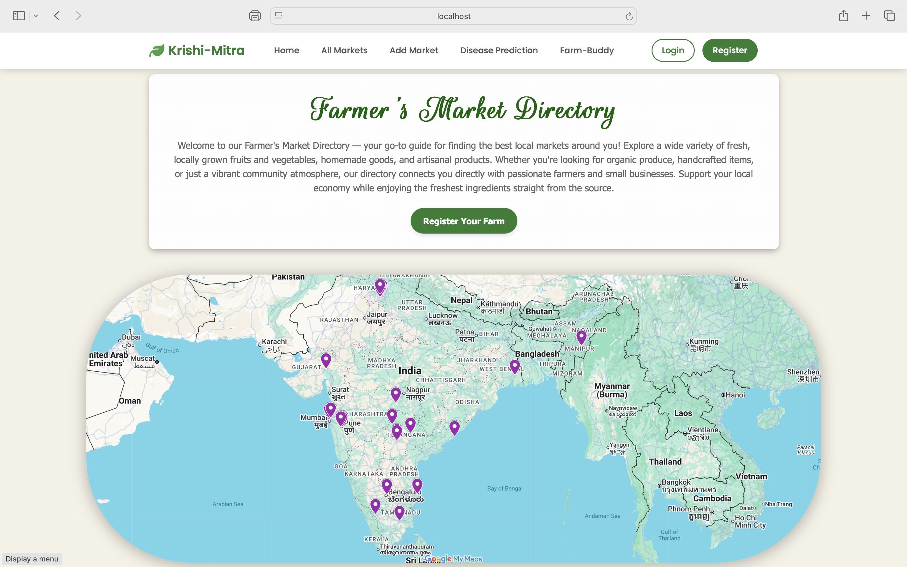
and below that we have all the markets listed on our website.
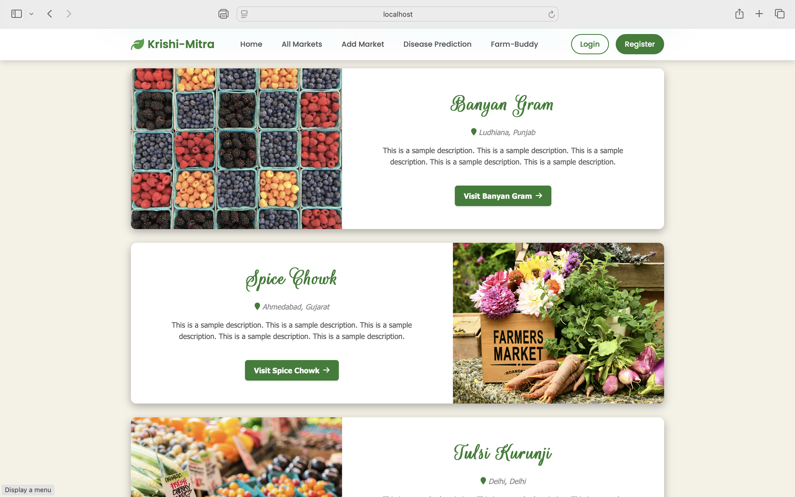

## Explore a Market

the explore market page gives you the detailed description of the market.
it consists of information such as precisce location along with fully responsive map.
description of the market, owner , price and season available. along with other info suh as :
hours, goods, parking, food.
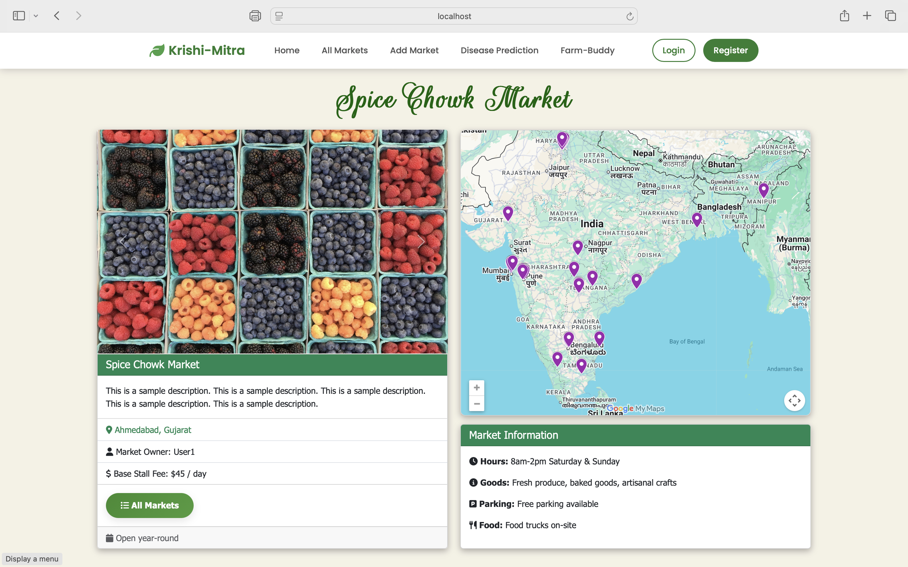
below that you can read the reviews left by other users and also leave your own reviews and rating(provided you are signed in).
if you are the owner and signedin, you also get an option to edit and delete the market.
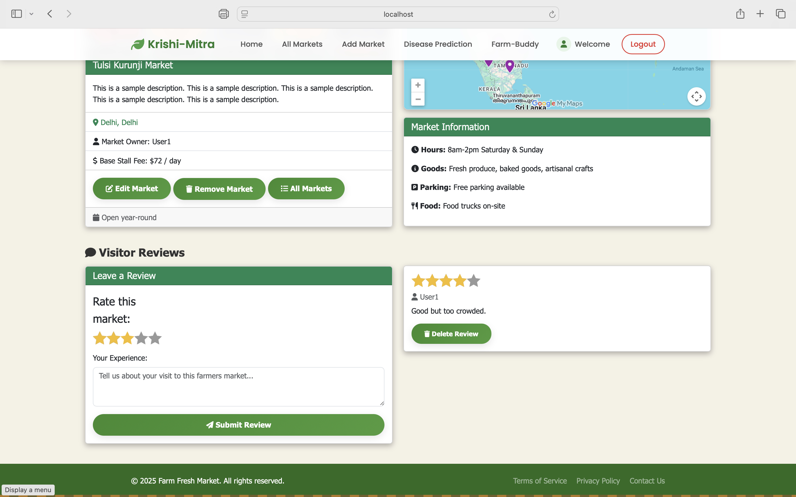

## Market creation page.

i am not going tp bore you by describing the different sections of the form.
all i wanna say s that it is a pretty in depth and beautiful fprm.

## User register and login

here we have our beautiful themed user register and sign in forms
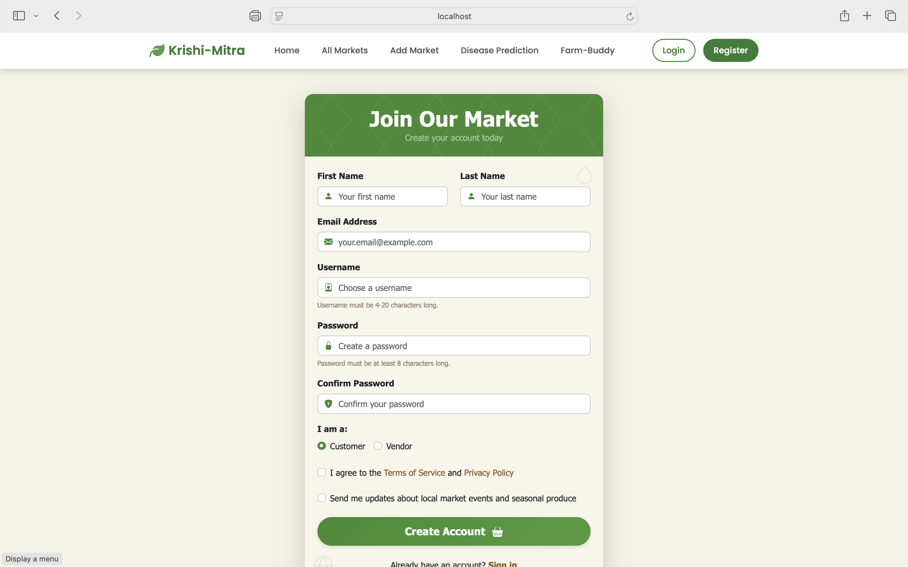
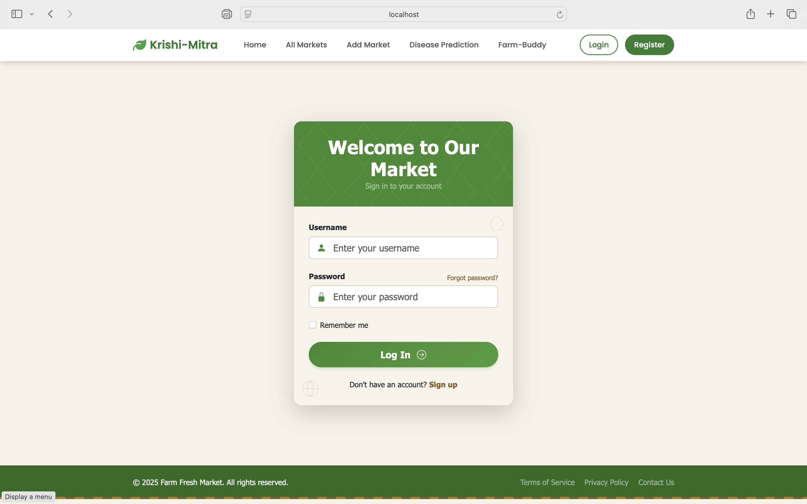

## Plant Disease detection app.

now we have come to the ai and ml powered part of the project.
this plant disease detection app uses an ensemble of 3 CNN models.
it has a whopping accuracy of arounf 98.5%.
It is capable of detecting 8 species and upto 20 diseases!.
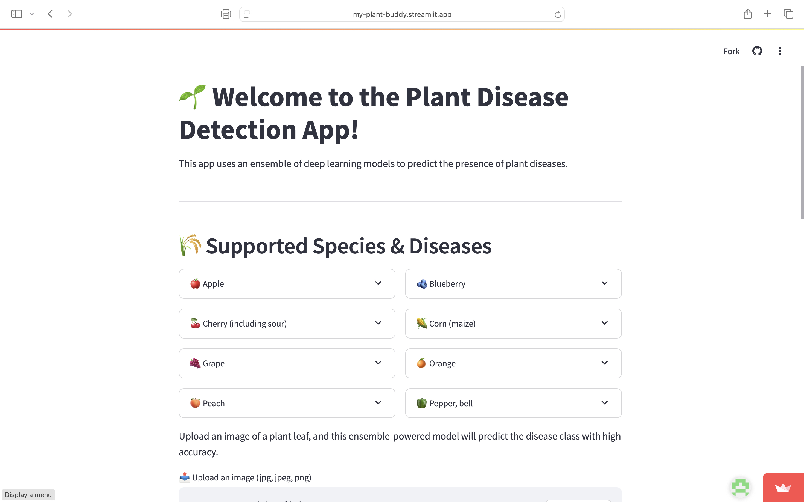

You can upload leaf images and the model will detect specie as well as the disease.
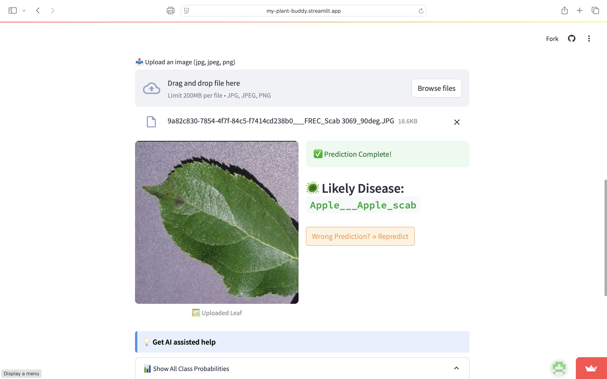
even though the accuracy is 98.5%, we cannot be arrogant and say that it will never give a wrong result. therefore. we have a button for repredict on wrong prediction. it will then give the next most likely disease. but from next time onwards, for the same leaf, it will give correct result in one go. this is because it stores results.

We also have a class probabilities bar chart which shows the probability of the leaf lying in a particular class

## Farm-ChatBot

we also have a farm chatbot that can help resolve queries such as disease remedies, precautions, best fertilisers, seasonal info etc. it does not do all this using an api. it is custom traned on farm related data given by us, if however it is unable t find answer from us, it then uses 3rd part api calls to get the answer. this intelligent fallback support helps always give an answer.

## Blogging

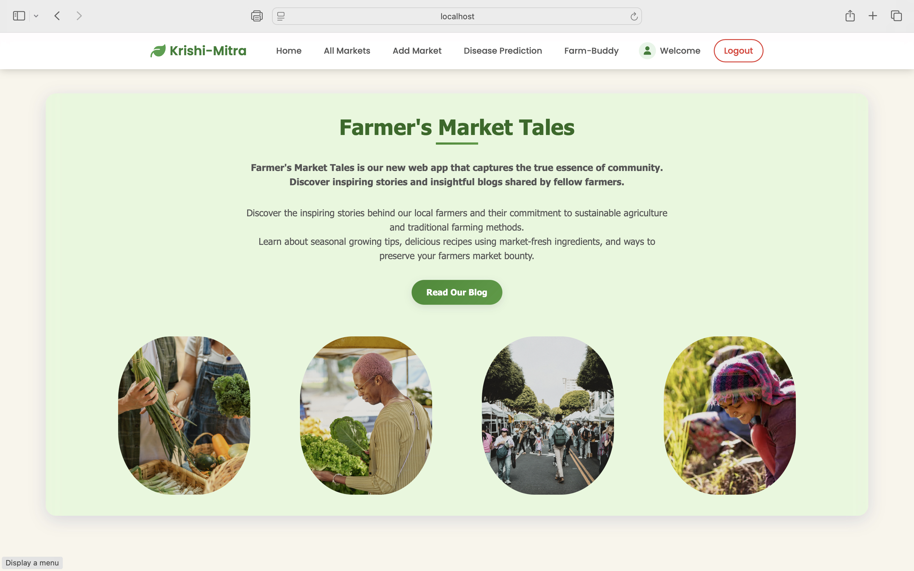
we all have stories to tell and experiences to share.
our blogging platform helps farmers share their experience with the community creating a more familiarenvironment and aware environment.
The blogging platform is also beautifull crafter=d and detailed.

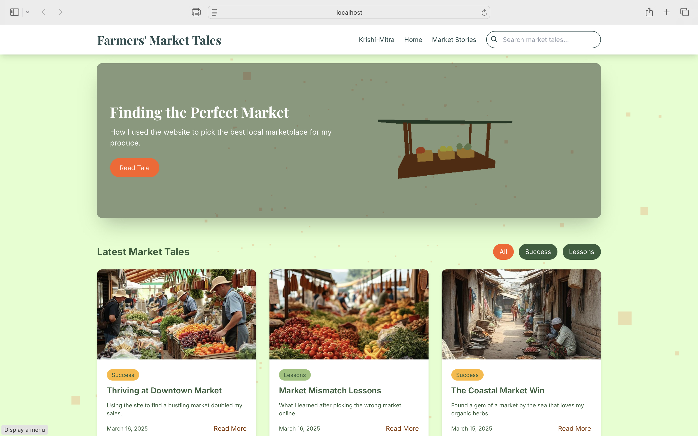
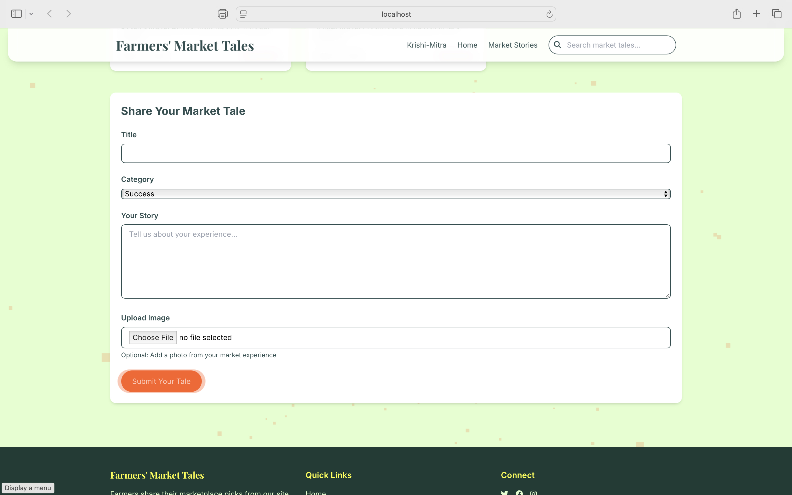
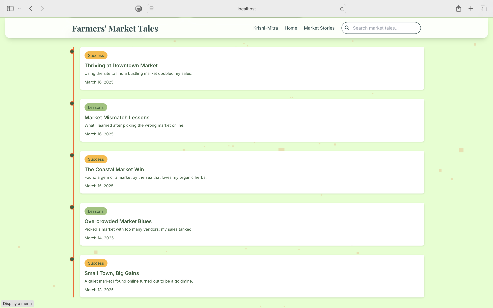

# technical information

-   🔐 **Secure Authentication and authorisation:** Robust user registration and login along with authorisation system with hashed passwords and secure session handling using Passport.js.
-   📐 **MVC Framework:** Developed using the industry popular and widely used **Model-View-Controller** architecture, ensuring scalable, clean, and maintainable code.
-   used mongodb for ...
-   used express for ...
-   used node for ..
-   🧠 **Intelligent Chatbot:** An AI-powered chatbot trained on agricultural and related daa. For out-of-scope questions, it seamlessly uses the **OpenAI API** to provide accurate and real-time answers as a fallback support.
-   🌿 **Plant Disease Detection:** higly accurate 98.5% along with 8 species and upto 20 diseases of those species. trained using an ensemble of pretrained models : densenet, effecientnet and mobilenet.Deployed using streamlit.

### 💡 Why this Project?

Agriculture is evolving, and so should the tools that support it. **Farmers' Companion** is built to **digitize essential services**, foster **community collaboration**, and bring **AI-driven insights** directly to the fields — all in one platform.

# 🌾 Hey there, fellow human! Welcome to Krishi Mitra! 

*Translation: "Farmers' Friend" - because who doesn't need a good friend, especially one that knows tech?*

So you stumbled upon **Krishi Mitra**, huh? Well, buckle up because this isn't your average "let's digitize farming" project. This is what happens when someone (me) had way too much coffee, a passion for agriculture, and thought "Hey, what if we could make farming as smart as smartphones?"

## 🤔 What the heck is this thing?

You know that feeling when you're trying to help farmers but all the existing solutions are either boring, confusing, or just plain useless? Yeah, me too. So I built this beast of a platform that's basically like having a tech-savvy farming buddy who never sleeps.

**Krishi Mitra** is a full-stack web application that does ALL the things:
- 🛒 **Direct selling** - Skip the middleman drama
- 🔬 **AI-powered disease detection** - Because plants get sick too
- 💬 **Smart chatbot** - Your 24/7 farming consultant
- 📝 **Community blogging** - Share your "this crop failed spectacularly" stories
- 🗺️ **Market directory** - Find markets without getting lost

## 🚀 The Grand Tour (Screenshots Included Because I'm Proud)

### Landing Page - First Impressions Matter!
Look, I spent *way* too much time on this landing page. It's beautiful, functional, and doesn't make your eyes bleed. Here's what you're getting yourself into:

*This is where the magic begins*

As you scroll down, you'll see more eye candy:

### Market Directory - Google Maps Wishes It Was This Cool
We've got an interactive map that actually works (shocking, I know) and a list of markets that won't leave you guessing.

*That's our fancy interactive map up top*

*All the markets, organized and ready to explore*

### Explore Markets - The Detailed Stuff
When you click on a market, you don't just get "Market exists. Location: somewhere." Nope! You get the full deal:
- Precise location with a map that actually loads
- What they sell and when
- Hours, parking, food options
- Real reviews from real people

*Everything you need to know about this market*

*Real people, real opinions, real helpful*

### Market Creation - For the Brave Souls
Want to add your own market? I built a form that's actually pleasant to use (revolutionary concept, I know).

*It's detailed but not painful*

### User Stuff - Register & Login
Because even farmers need secure accounts:

*Clean, simple, secure - the holy trinity*

## 🧠 The AI Magic - Plant Disease Detection

Okay, this is where I get really excited. Remember how I mentioned AI-powered disease detection? Well, I wasn't kidding.

**The Stats That Matter:**
- 98.5% accuracy (yeah, you read that right)
- 8 different plant species
- Up to 20 diseases detected
- Uses an ensemble of 3 CNN models because one just wasn't enough

*Upload a leaf photo, get instant diagnosis*

*Complete with probability charts because data is beautiful*

**The Cool Part:** If the AI gets it wrong (hey, nobody's perfect), there's a "repredict" button that gives you the next most likely result. Plus, it learns from mistakes, so next time it'll get it right on the first try.

## 🤖 Farm ChatBot - Your 24/7 Farming Buddy

This isn't just another chatbot that gives you generic responses. This one's actually trained on real farming data and knows its stuff about:
- Disease remedies
- Fertilizer recommendations
- Seasonal advice
- General farming wisdom

**Smart Fallback:** If it can't answer from its training data, it seamlessly uses the OpenAI API as backup. So you always get an answer, never a "I don't know" response.

## 📝 Blogging Platform - Share Your Stories

*Because everyone has farming stories to tell*

*A full-featured blogging platform that doesn't suck*

Whether you want to share your success stories, epic failures, or just daily farm life, this platform has you covered.

## 🛠️ The Technical Stuff (For the Nerds)

**Architecture:** Built with the tried-and-true MVC pattern because I believe in doing things right.

**Security:** 
- Secure authentication with Passport.js
- Password hashing (because storing passwords in plain text is so 2005)
- Session management that actually works

**Database:** MongoDB for flexible data storage

**Backend:** Node.js with Express.js for the API

**AI/ML:** 
- Ensemble of DenseNet, EfficientNet, and MobileNet models
- Deployed with Streamlit
- Custom training on agricultural datasets

**APIs:** OpenAI integration for chatbot fallback support

## 🌱 Why Did I Build This?

Simple. Agriculture is the backbone of civilization, but most farming tools are stuck in the stone age. I wanted to create something that:
- Actually helps farmers
- Doesn't require a PhD in computer science to use
- Brings AI benefits to agriculture
- Builds community among farmers
- Looks good while doing it

**Krishi Mitra** isn't just another app - it's a complete ecosystem for modern farming.

## 🚀 Want to Try It Out?

[Add your deployment link here]

## 🤝 Contributing

Found a bug? Have a feature idea? Want to make farming even more awesome? Open an issue or submit a PR. I'm always up for making this better.

## 📜 License

[Add your license here]

---

*Built with ❤️, lots of ☕, and a genuine desire to help farmers thrive in the digital age.*

**Remember:** Every great harvest starts with a single seed. Let's grow something amazing together! 🌱